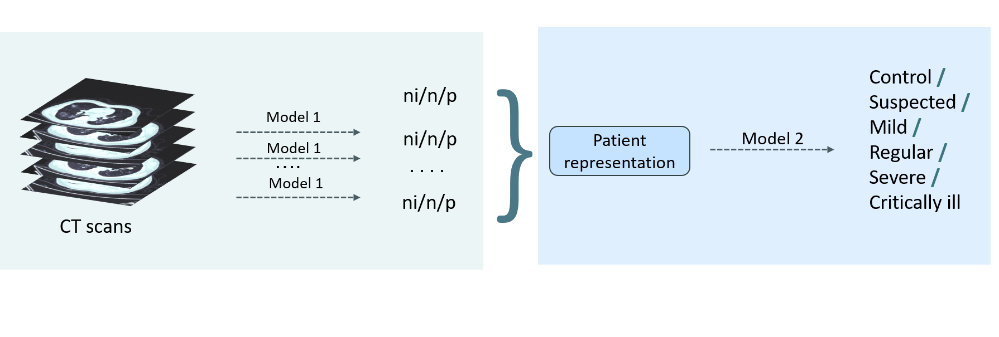
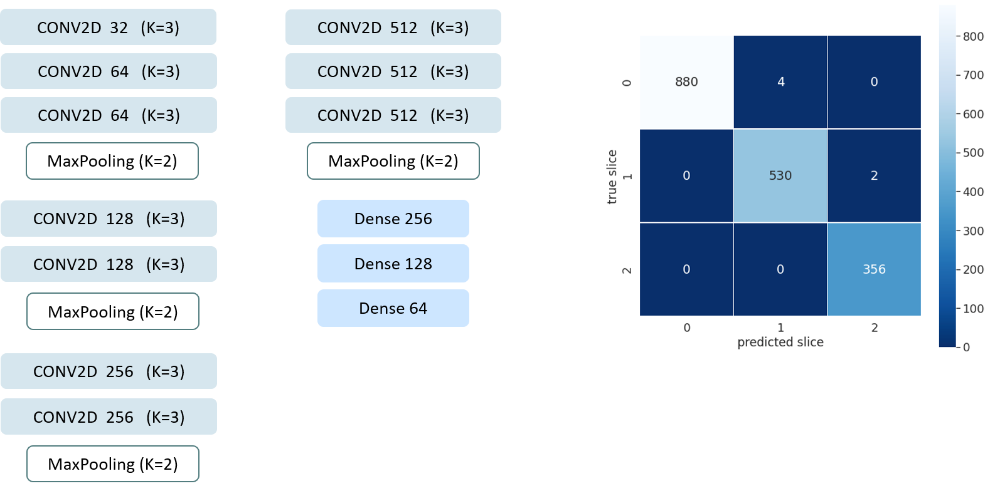
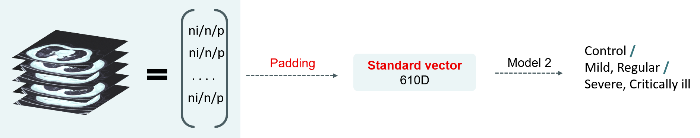
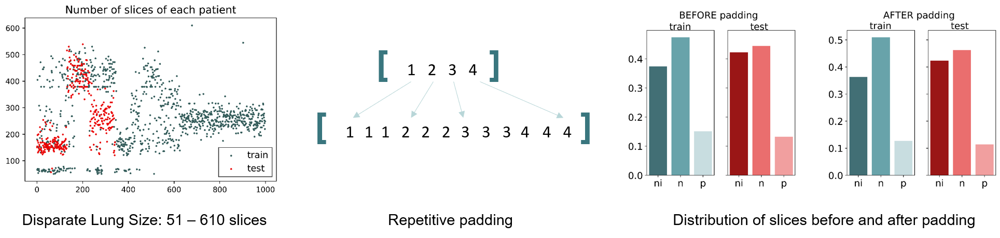
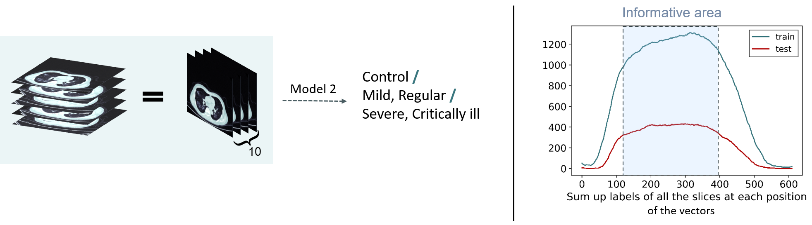
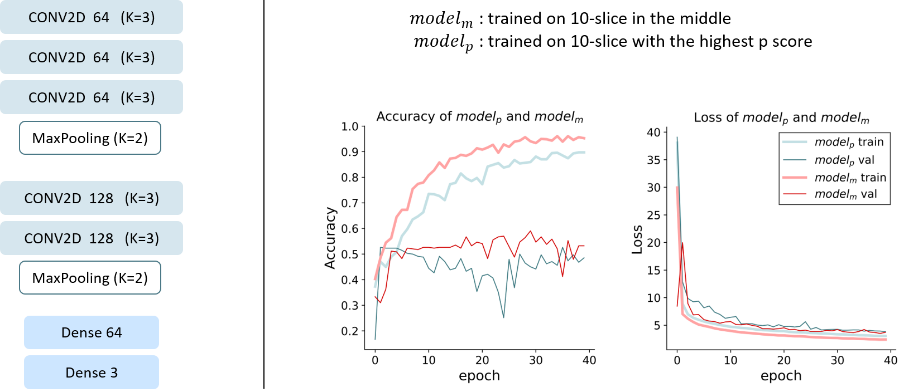

# COVID-19-recognition-using-CT-scans
Recognize COVID-19 using CT volumes by means of slice-based and patient-based methods.

## Why CT scans?
- Can help detect severity of infection
- It takes an experienced radiologist 5-10 minutes to analyze one CT scan
- Can be crucial for an early diagnosis

## Dataset
Rhe dataset is published by a [university research center](http://ictcf.biocuckoo.cn/Resource.php) where the CT scans of 1341 patients are available. Specifically, it contains 19,685 CT slices, including: 
(i) 5705 non-informative CT (NiCT) images where lung parenchyma was not captured for any judgment 
(ii) 4001 positive CT (pCT) images where imaging features associated with COVID19 pneumonia could be unambiguously discerned 
(iii) 9979 negative CT (nCT) images where imaging features in both lungs were irrelevant to COVID-19 pneumonia.

Apart from the CT, other information about each patient is also available. Each person is labelled as "critically ill", "severe", "regular", "mild", "suspect", or "control". Among these 6 categories, "control" means "healthy", "suspect" means "unknown" and the rest means "ill". Apart from classifying each CT slice, we also need to classify each patient. 
In this dataset, “mild” and “critically ill” does not have enough samples, and the category of “suspect” is noisy data in this case, because a suspected patient can either be ill or not in the end. Therefore, we remove suspect, combine mild with regular, and combine severe with critically ill, and in the end we turn a 6-category classification into a 3-category one.

## Method
Two methods are explored to extract and represent the features of a patient's CT volume. Method 1 has a workflow of two phases and method 2 uses 3D CNN.

### Method 1
This method has a two-phase workflow, where phase 1 does slice-based 3-category classification and phase 2 carried out patient-based 6-categoty classification.

#### Phase 1

It worths noting that when training this model, no augmentation is employed, since shearing, horizontal flip and cropping will change the important features of a lung slice, leading to noisy and confusing textures.

#### Phase 2
In phase 2, given the predictions of a bunch of slices, we target to determine how ill a person is. Given the CT volume of a patient, we are to represent a patient, and the first method is vectorization. 

#### Strategy 1: vectorization
In this strategy, the prediction of each slice corresponds to an element in the vector, which gives us over 1000 vectors of different lengths, since in the dataset the number of slices varies from 51 to 610. Therefore, we need to pad it to a 610D vector before feeding it to the model.

The padding method employed is “repetitive padding”. We first sparsely expand the vector to 610D and fill it with numbers in a duplicating fashion. One justification of this method is that the distribution of slices before and after the padding is almost the same. Therefore, this method standardizes the vectors without disturbing their original pattern.

Several simple models fit the data and the performance is as follows:
Model | Train acc. | Test acc. |
:--------:|:--------------:|:--------:|
Random forest | 0.995 | 0.444  
SVM-gaussian | 0.993 | 0.526
Neural network  | 0.522 | 0.523 

All the three models suffer from severe overfitting (the NN model seems free from overfitting because early stopping is employed). One explanation is that the method of vectorization is oversimplifying the information in a CT volume. The elements of a vector are invariant, which can only be 0/1/2, and generally many patients’ vectors are in a similar format of "01210".

#### Strategy 2: 10-slice feature map
In this strategy, we use a 10-slice feature map to represent each patient. The idea is to pick 10 representative slices from the CT volume, stack them together as a 10-slice feature map and input to the model. 

In terms of the way of picking the 10 slices, we might: 
(i) pick 10 slices with the highest p score, because we are essentially interested in whether a patient contains a lot of positive slice.  
(ii) pick 10 slices form the middle of the volume, because as shown in the figure above (right), the slices in the middle are usually most "imformative".

It is illustrated that if we sum up the labels of a slice at each position of the vectors, we can notice that the middle has higher sum because there are more 1s and 2s there, which means that the middle is more informative. 
Moreover, if we simply pick 10 slices from the middle of the CT volume, it has an advantage: Since it’s hand-designed and does not require model1, the performance of model2 will not be disturbed by the error of model1.

### Method 2
This method uses 3D CNN to directly recognize the health stage of a patient. The model employs the architecture of Res3DNet and its training process is shown below.

The final test accuracy is ? and the final test F1 score is ?. Therefore, the method of 3D CNN outperforms the method using vector representation and the method treating a slice as a feature channel. 
